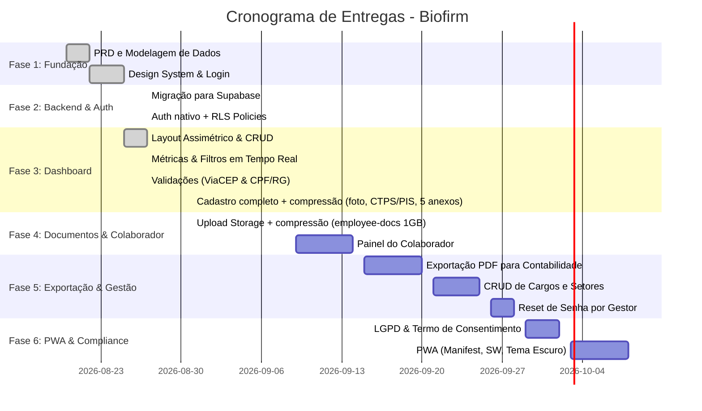

# 🗺️ Cronograma & Roadmap de Desenvolvimento — Biofirm

> **Sistema de Cadastro e Gestão de Colaboradores**  
> Documento de rastreabilidade, status de entregas e planejamento de próximas etapas com base no [PRD.md](file:///c:/Biofirme/PRD.md) e requisitos operacionais.  
> **Última atualização:** 31/08/2026 23:00 — Cadastro completo + compressão + Storage

---

## 📊 Visão Geral do Progresso



---

## 📌 Status Detalhado por Fase

| Fase | Descrição | Status | Conclusão |
| :--- | :--- | :---: | :---: |
| **Fase 1** | Fundação, Banco Supabase & Identidade Visual | ✅ **Concluído** | 100% |
| **Fase 2** | Backend Supabase Auth + RLS | ✅ **Concluído** | 100% |
| **Fase 3** | Dashboard, CRUD, Validações & Máscaras + Cadastro completo | ✅ **Concluído (31/08)** | 100% |
| **Fase 4** | Storage + compressão (foto, 5 docs) ✅ / Painel colaborador pendente | 🔄 **Em progresso** | 60% |
| **Fase 5** | Exportação PDF, Gestão de Cargos/Setores | 📋 **Planejado** | 0% |
| **Fase 6** | PWA & Compliance (LGPD) | 📋 **Planejado** | 0% |

---

## ✅ Fase 1: Fundação (Concluída - 22/08/2026)

### Entregas
- ✅ PRD completo com requisitos funcionais e não-funcionais
- ✅ Modelagem inicial do banco de dados (Supabase PostgreSQL)
- ✅ Design System: tipografia (Playfair Display + Inter + JetBrains Mono), paleta de cores, componentes base
- ✅ Tela de login com identidade visual Biofirm

### Stack Inicial
- Frontend: HTML5 + CSS3 + JavaScript vanilla
- Backend: Supabase (PostgreSQL)
- Autenticação: Custom (usuário/senha em tabela `users`)

---

## ✅ Fase 2: Backend Supabase Auth + RLS (Concluída - 27/08/2026)

### Entregas
- ✅ **Migração completa para Supabase Auth nativo**
  - Tabela `auth.users` para autenticação
  - Tabela `public.profiles` com FK para auth.users
  - Trigger automático: `on_auth_user_created` cria profile ao registrar usuário
  - Login via `supabase.auth.signInWithPassword()`
  - Sessão persistente via SessionStorage
  
- ✅ **Row Level Security (RLS) completo**
  - Policy de leitura: todos autenticados podem ler employees
  - Policy de escrita: apenas admin/gestor/manager podem INSERT/UPDATE
  - Policy de exclusão: apenas admin pode DELETE
  - Função `current_user_role()` para checar role via `auth.uid()`
  
- ✅ **Migrations versionadas aplicadas**
  - `20260101000000_align_users_employees_structure.sql`: constraints, índices, trigger updated_at
  - `20260101000100_rls_policies.sql`: policies iniciais (descontinuadas)
  - `20260101000200_security_definer_fix.sql`: revoga acesso anon a funções sensíveis
  - `20260101000300_employees_rpc.sql`: função current_user_role
  - `20260101000400_auth_migration.sql`: profiles + trigger + policies RLS finais
  - `20260101000500_fix_profiles_policies.sql`: corrige recursão infinita em policies
  - `20260101000600_add_employee_address_fields.sql`: adiciona colunas de endereço

- ✅ **Remoção do backend Express**
  - Deletado `server.js`
  - Removidas dependências: express, cors, dotenv, bcryptjs, sqlite3
  - Frontend comunica direto com Supabase via `@supabase/supabase-js`

### Stack Final
- Frontend: HTML5 + CSS3 + JavaScript vanilla + Supabase JS SDK
- Backend: Supabase (PostgreSQL + Auth + Edge Functions + RLS)
- Hospedagem: Pronto para Vercel (frontend estático) + Supabase (backend serverless)

---

## ✅ Fase 3: Dashboard, CRUD, Validações & Máscaras (Concluída - 27/08/2026) + Patch Cadastro Completo (31/08/2026) + Patch Cadastro Completo (31/08/2026)

### Entregas
- ✅ **Dashboard principal** (`dashboard.html`)
  - Layout assimétrico com sidebar de detalhes
  - Listagem de funcionários em tabela responsiva
  - Métricas em tempo real: Total, Ativos, Pendentes, Aprovados
  - Filtros por status, vínculo e busca textual (nome, CPF, cargo, setor)
  
- ✅ **CRUD completo de funcionários**
  - Modal de criação/edição com todos os campos (dados pessoais + endereço)
  - Integração com Supabase via `supabaseClient.from('employees')`
  - INSERT, UPDATE, DELETE protegidos por RLS
  - Trigger automático de `updated_at` ao editar
  
- ✅ **Validações em tempo real**
  - **CPF**: validação por dígito verificador, máscara `000.000.000-00`
  - **RG**: validação **7 a 13 dígitos** (`js/mask.js:19`, `js/dashboard.js:418`), máscara `00.000.000-00000` (`dashboard.html:163` maxlength 16) — ex. `2003099021736` → `20.030.990-21736`
  - **CEP**: integração com ViaCEP, busca automática ao sair do campo, preenchimento de logradouro, bairro, cidade, UF
  - **CTPS**: máscara `000000/000-0` (`js/mask.js:66`) + **PIS/PASEP**: `000.00000.00-0` (`js/mask.js:56`)
  - **Telefone**: máscara `(00) 00000-0000`
  - Feedback visual de erros em tempo real
  
- ✅ **Cadastro completo — patch 31/08/2026** (`dashboard.html`, `js/dashboard.js`, `js/compress.js`, `css/style.css`)
  - Foto de perfil circular + preview + upload `storage:employee-docs/foto/*`
  - Campos `ctps_numero` (CTPS) e `pis_pasep` (PIS/PASEP) com máscaras
  - 5 anexos: `RG frente*`, `RG verso*`, `CPF cópia`, `Comprovante endereço`, `CTPS cópia` (`image/*`/`pdf`, 10MB cada) → `rg_frente_url`, `rg_verso_url`, `cpf_doc_url`, `comprovante_endereco_url`, `ctps_doc_url`
  - Compressão `js/compress.js` (canvas WebP 0.72, max 1280px/foto 800px, ~75% redução) para caber no **1GB** Storage
  - Ficha lateral com foto + `X/5 docs` + CTPS/PIS, modal ficha com links docs, tabela com avatar
- ✅ **Correções e refinamentos**
  - Máscara de RG ajustada para **13 dígitos** (antes 10) — `2003099021736` → `20.030.990-21736` (`maxlength 16`)
  - Constraints CHECK `status` (`Enviado para Contabilidade`, `Inativo`) e `vinculo` (`Inativo`) corrigidos via `add_cadastro_completo_foto_docs`
  - Índices em `pis_pasep`, `ctps_numero` além de cpf/setor/status/name/email/cep

### Usuários de Teste Criados
- **admin.teste@biofirm.local** / `senha123` (role: admin)
- **gestor.biofirm@biofirm.local** / `gestor123` (role: gestor)

---

## 🔄 Fase 4: Storage + Compressão ✅ + Painel do Colaborador (Em progresso — 31/08/2026, 60%)

### Entregas 31/08 (concluído)
- ✅ Bucket `storage.buckets:employee-docs` público, 10MB limite, `jpeg/png/webp/pdf/heic` + policies `employee_docs_authenticated_all` / `public_read` (`create_employee_docs_bucket`)
- ✅ `js/compress.js` canvas WebP/JPEG (1280px, 0.72) — economia 1GB (~2000 fotos vs ~250)
- ✅ Cadastro completo no `dashboard.html` (foto + 5 anexos com preview/compressão) + `js/dashboard.js` upload `supabase.storage.from('employee-docs').upload()`

### Objetivos restantes
- [x] Configurar Supabase Storage para upload de documentos
- [x] Upload de fotos e documentos (PDF, JPEG) com limite de 10MB + compressão
- [x] Visualização de anexos no detalhe do funcionário (ficha lateral + modal)
- [ ] Painel do colaborador (rota `/colaborador.html`)
  - Login com credenciais de colaborador
  - Visualização e edição dos próprios dados
  - Upload de documentos pessoais
  - Policy RLS: colaborador edita apenas próprio registro

### Dependências
- Supabase Storage buckets configurados
- Policy RLS para `user` role em employees

---

## 📋 Fase 5: Exportação PDF & Gestão de Cargos/Setores (Planejado - Set/2026)

### Objetivos
- [ ] Exportação de ficha do funcionário em PDF (via biblioteca jsPDF ou Puppeteer)
- [ ] Template de PDF para contabilidade com todos os dados + anexos
- [ ] CRUD de Cargos e Setores (tabelas auxiliares)
- [ ] Dropdown dinâmico no formulário de funcionário
- [ ] Reset de senha por gestor (gera senha temporária, colaborador troca no primeiro login)

### Dependências
- Tabelas `cargos` e `setores`
- Edge Function para reset de senha

---

## 📋 Fase 6: PWA & Compliance (LGPD) (Planejado - Out/2026)

### Objetivos
- [ ] Manifest.json para PWA (ícones, nome, tema)
- [ ] Service Worker para cache offline
- [ ] Tema escuro (toggle no header)
- [ ] Termo de consentimento LGPD (modal no primeiro acesso)
- [ ] Política de privacidade e tratamento de dados

### Dependências
- Ícones em múltiplos tamanhos
- Service Worker implementado

---

## 🔧 Stack Tecnológica Final (31/08/2026)

| Camada | Tecnologia |
|--------|------------|
| **Frontend** | HTML5 + CSS3 + JavaScript vanilla + `js/compress.js` (canvas WebP) |
| **Backend** | Supabase (PostgreSQL + Auth + RLS + Edge Functions + Storage `employee-docs`) |
| **Autenticação** | Supabase Auth (JWT automático) |
| **Storage** | Supabase Storage `employee-docs` (público, 10MB, compressão ~75% para 1GB) |
| **Hospedagem** | Vercel (frontend) + Supabase (backend) |
| **Validações** | ViaCEP + CPF/RG 7-13/CTPS/PIS máscaras |

---

## 📝 Notas de Implementação

### Migrations Aplicadas (até 31/08/2026)
1. `20260101000000_align_users_employees_structure` - Constraints, índices, trigger updated_at
2. `20260101000100_rls_policies` - Policies RLS iniciais + grants
3. `20260101000200_security_definer_fix` - Revoga acesso anon a funções sensíveis
4. `20260101000300_employees_rpc` - Função current_user_role() + policies simplificadas
5. `20260101000400_auth_migration` - Profiles + trigger on_auth_user_created + policies finais
6. `20260101000500_fix_profiles_policies` - Corrige recursão infinita em policy de profiles
7. `20260101000600_add_employee_address_fields` - Colunas endereço (rg, data_nascimento, telefone, email, cep, logradouro, numero, complemento, bairro, cidade, uf)
8. `add_cadastro_completo_foto_docs` (31/08) - `foto_url`, `ctps_numero`, `pis_pasep`, `rg_frente_url`, `rg_verso_url`, `cpf_doc_url`, `comprovante_endereco_url`, `ctps_doc_url` + fix CHECKs + índices pis/ctps
9. `create_employee_docs_bucket` (31/08) - Bucket `employee-docs` público 10MB + policies

### Arquivos Principais (31/08)
- `index.html` - Login
- `dashboard.html` - Dashboard + cadastro completo (foto, CTPS/PIS, 5 anexos)
- `css/style.css` - Design System + file inputs documentais
- `js/app.js` - Login
- `js/dashboard.js` - CRUD + uploads comprimidos + ficha com docs
- `js/mask.js` - Máscaras (CPF, RG 7-13, CTPS, PIS, CEP, telefone)
- `js/compress.js` - Compressão canvas WebP/JPEG para 1GB
- `js/supabase.js` - Client Supabase
- `.env` - SUPABASE_URL / KEYS

### Comandos Úteis
```bash
# Servir localmente
npx http-server -p 8080 -c-1

# Acessar
http://localhost:8080
```

---

## 🎯 Próximos Passos Imediatos (31/08)

1. **Deploy Vercel** (frontend com cadastro completo já pronto)
2. **Painel do colaborador** `/colaborador.html` com RLS por `auth.uid()` (reutiliza `employee-docs`)
3. **Exportação PDF** ficha com foto + 5 anexos para contabilidade
4. **CRUD Cargos/Setores** + validação CTPS/PIS digito

---

**Documento mantido por:** Equipe Biofirm  
**Contato:** [adicionar contato se necessário]
